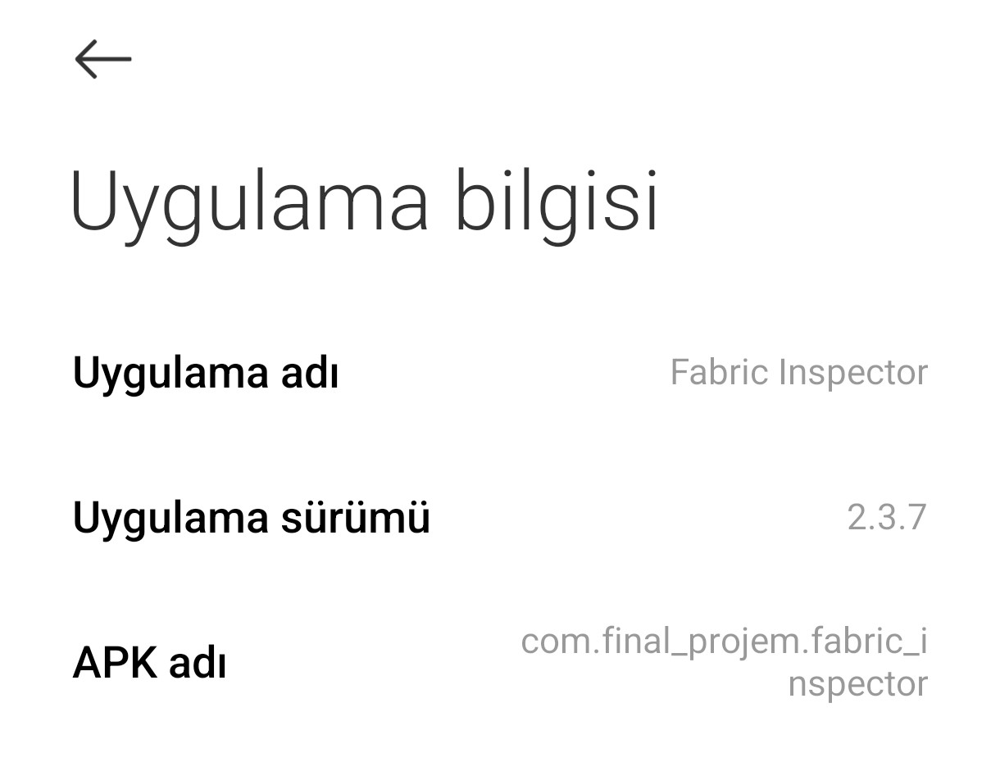
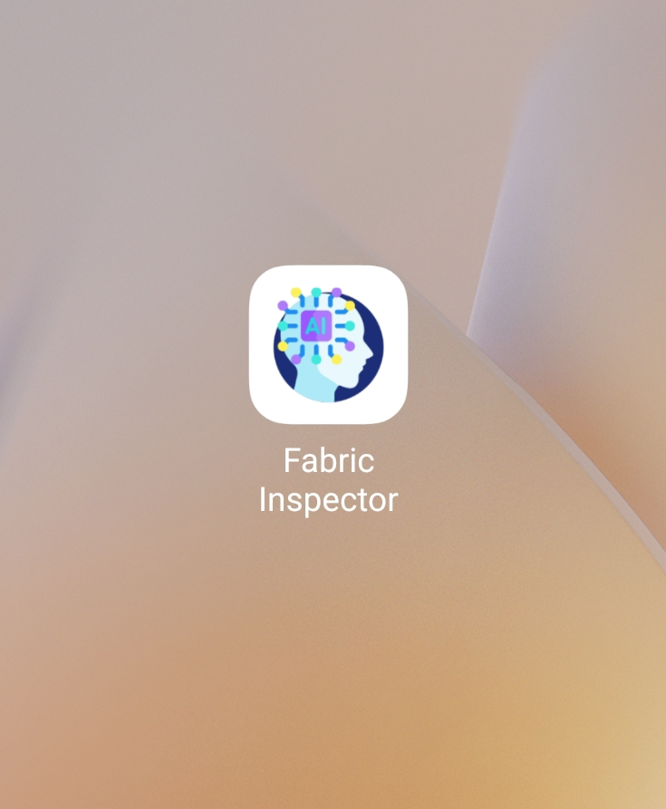
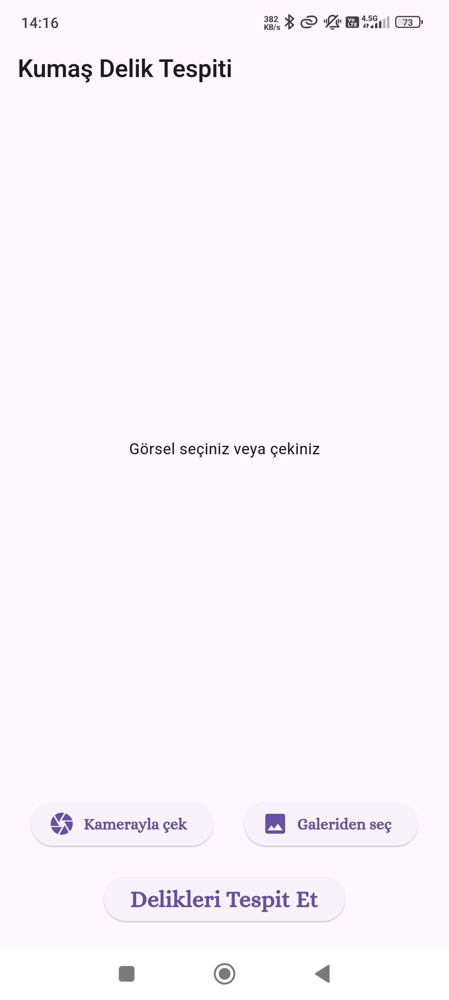
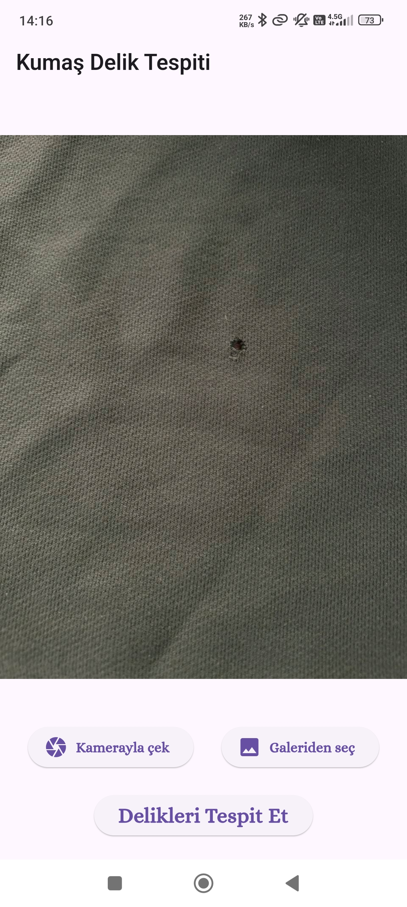
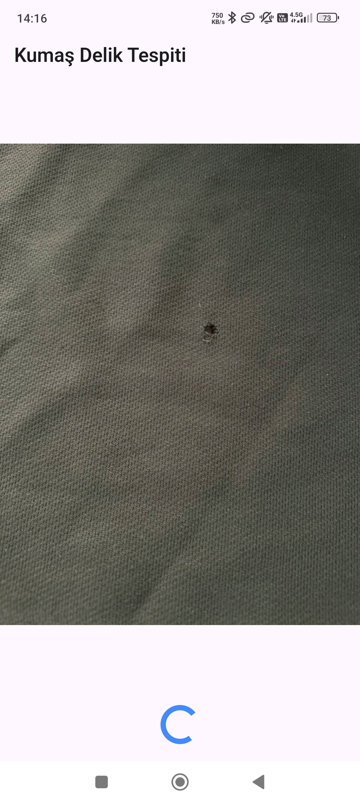
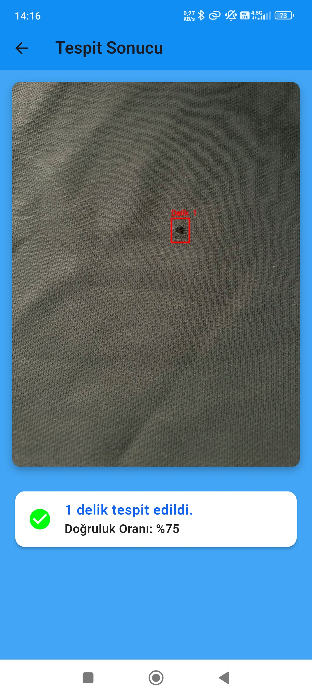
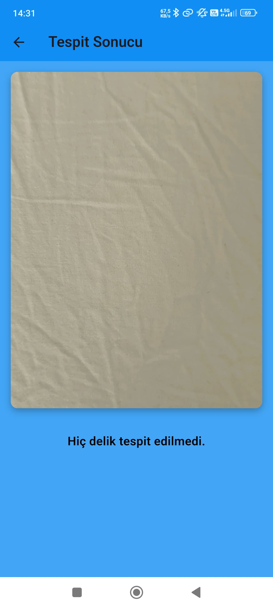

# Fabric Hole Detection Mobile Application

## Introduction

This project aims to develop a mobile application that can automatically detect holes in fabric using a deep learning model integrated into the app. The system involves training a YOLOv8-based object detection model to identify holes in fabric images and integrating this model into a user-friendly mobile application developed with Flutter. The backend is implemented using FastAPI to facilitate communication between the mobile app and the model.

## Development Approach

This project was developed in accordance with the **Waterfall Model** methodology, as outlined in the attached documentation. Each phase **Requirement Analysis**, **System Design**, **Implementation**, **Integration and Testing**, **Deployment**, and **Maintenance**was sequentially executed to ensure a systematic and error-minimized development process. Details of this methodology can be found in the accompanying PDF document: [Waterfall Model Documentation](./Proje%20Raporu.pdf).

## Download

You can download the latest release of the application here:

[Download Fabric Inspector (Release Build)](./Fabric%20Inspector%20Release%20Build.apk)

## Usage

1. **Open the mobile application**.
2. **On the home screen**, choose to take a photo or select one from your gallery.
3. **After selecting an image**, tap on the "Detect Holes" button.
4. **The app will send the image to the backend server**, which processes it and returns the detection results.
5. **The detected holes will be displayed on the image**, along with the number of holes and confidence scores.

---

## Features

- **Automatic Hole Detection**: Utilizes a YOLOv8 deep learning model to detect holes in fabric images.
- **User-Friendly Interface**: Allows users to capture or select images from their gallery.
- **Real-Time Results**: Displays the number of detected holes, their locations, and confidence scores.
- **Cross-Platform Support**: Developed using Flutter for both iOS and Android platforms.
- **Efficient Backend Communication**: Uses FastAPI for quick and reliable communication between the app and the model.

## Technologies Used

- **Deep Learning and Model Development**:
  - Python
  - YOLOv8
  - TensorFlow
  - PyTorch
  - OpenCV
  - NumPy
  - Pillow
- **Data Sources and Labeling**:
  - Kaggle
  - Roboflow
- **Mobile Development and Backend**:
  - Flutter
  - Dart
  - FastAPI
  - Uvicorn
- **Deployment and Tools**:
  - Render.com
  - Postman

## Installation

### Backend

1. **Clone the repository**:

   ```bash
   git clone https://github.com/yourusername/fabric-hole-detection.git
   ```

2. **Navigate to the backend directory**:

   ```bash
   cd fabric-hole-detection/backend
   ```

3. **Install the required packages**:

   ```bash
   pip install -r requirements.txt
   ```

4. **Run the FastAPI server**:

   ```bash
   uvicorn main:app --reload
   ```

### Mobile Application

1. **Navigate to the mobile app directory**:

   ```bash
   cd fabric-hole-detection/mobile_app
   ```

2. **Get the Flutter packages**:

   ```bash
   flutter pub get
   ```

3. **Run the app on your device or emulator**:

   ```bash
   flutter run
   ```

## Usage

1. **Open the mobile application**.
2. **On the home screen**, choose to take a photo or select one from your gallery.
3. **After selecting an image**, tap on the "Detect Holes" button.
4. **The app will send the image to the backend server**, which processes it and returns the detection results.
5. **The detected holes will be displayed on the image**, along with the number of holes and confidence scores.

## Screenshots

Below are some screenshots of the application:

|                                            |                                            |                                            |
|--------------------------------------------|--------------------------------------------|--------------------------------------------|
|  |  |  |
|  |  |  |
|  |                                            |                                            |

## Project Structure

- **backend/**: Contains the FastAPI backend server files.
  - **main.py**: The main FastAPI application.
  - **model/**: Contains the trained YOLOv8 model in TFLite format.
  - **requirements.txt**: Lists the required Python packages.
- **mobile_app/**: Contains the Flutter mobile application files.
  - **lib/**: Contains the Dart code for the application.
  - **pubspec.yaml**: Defines the dependencies for the Flutter project.
- **Assets/**: Contains the images used in the README and application.

## Contributing

Contributions are welcome! Please fork the repository and submit a pull request.

## License

This project is licensed under the MIT License - see the [LICENSE](LICENSE) file for details.

## Acknowledgments

- **Ultralytics YOLOv8 Documentation**: [https://docs.ultralytics.com](https://docs.ultralytics.com)
- **Flutter Official Documentation**: [https://flutter.dev/docs](https://flutter.dev/docs)
- **FastAPI Documentation**: [https://fastapi.tiangolo.com](https://fastapi.tiangolo.com)
- **Kaggle Datasets**: [https://www.kaggle.com](https://www.kaggle.com)
- **Roboflow**: [https://roboflow.com](https://roboflow.com)

---
